# Rapport d'audit securite

## 1. Presentation du projet

Ce projet est une application web de gestion de tickets de support realisee pour le projet final de securite web avancee.

L'application permet a des utilisateurs de :

- creer un compte ;
- se connecter ;
- creer des tickets de support ;
- consulter leurs tickets ;
- ajouter des commentaires ;
- consulter une interface admin selon le role.

Le projet est organise en deux versions dans le meme depot Git :

- branche `vulnerable` : version volontairement vulnerable ;
- branche `secure` : version corrigee et securisee.

L'objectif est de demontrer un cycle complet de securite applicative : creation d'une application vulnerable, exploitation controlee des failles, correction des causes profondes, validation des corrections et automatisation de controles de securite dans une pipeline DevSecOps.

## 2. Architecture de l'application

### Stack technique

- Frontend : Next.js
- Backend : Node.js avec Express
- Base de donnees : MongoDB Atlas
- Authentification : JWT
- Pipeline : GitHub Actions

### Structure du depot

```text
frontend/                 Interface web Next.js
backend/                  API REST Express
backend/test/             Tests de securite backend
frontend/test/            Tests de securite frontend
.github/workflows/        Pipeline CI/CD securite
docs/screenshots/         Captures de preuves
SECURITY_AUDIT.md         Rapport d'audit
README.md                 Installation et lancement
```

### Collections MongoDB

- `users` : utilisateurs, emails, mots de passe hashes, roles.
- `tickets` : tickets de support, proprietaire, statut, priorite, note interne.
- `comments` : commentaires lies aux tickets.

## 3. Installation et lancement

### Backend

```bash
cd backend
npm install
copy .env.example .env
npm run seed
npm run dev
```

Backend :

```text
http://localhost:4000
```

### Frontend

```bash
cd frontend
npm install
npm run dev -- -p 3001
```

Frontend :

```text
http://localhost:3001
```

### Comptes de test - branche vulnerable

| Role | Email | Mot de passe |
| --- | --- | --- |
| user | user1@example.com | password123 |
| user | user2@example.com | password123 |
| admin | admin@example.com | admin123 |

### Comptes de test - branche secure

| Role | Email | Mot de passe |
| --- | --- | --- |
| user | user1@example.com | User1Secure!2026 |
| user | user2@example.com | User2Secure!2026 |
| admin | admin@example.com | AdminSecure!2026 |

## 4. Organisation Git

Le depot contient deux branches principales :

```text
vulnerable  version volontairement vulnerable
secure      version corrigee et securisee
```

Les corrections de securite sont appliquees dans la branche `secure` a partir de la branche `vulnerable`.

## 5. Liste des vulnerabilites integrees

| ID | Nom | Type | Criticite |
| --- | --- | --- | --- |
| VULN-01 | NoSQL Injection sur login | Injection | Critique |
| VULN-02 | IDOR/BOLA sur consultation de ticket | Broken Access Control | Elevee |
| VULN-03 | XSS stockee dans les commentaires | Cross-Site Scripting | Elevee |
| VULN-04 | Authentification faible | Authentication Weakness | Elevee |
| VULN-05 | Mass Assignment / elevation de privilege | Mass Assignment | Critique |
| VULN-06 | Information Disclosure | Security Misconfiguration | Elevee |
| VULN-07 | Validation insuffisante des entrees | Input Validation | Moyenne |

## 6. Audit detaille des vulnerabilites

## VULN-01 - NoSQL Injection sur login

### Type

Injection / NoSQL Injection.

### Endpoint concerne

```text
POST /api/auth/login
```

### Description

L'endpoint de connexion de la branche `vulnerable` accepte directement les valeurs envoyees dans le corps de la requete et les utilise dans une requete MongoDB.

Un attaquant peut envoyer des operateurs MongoDB comme `$ne` au lieu d'un email et d'un mot de passe classiques.

### Cause technique

Dans `backend/src/routes/auth.js`, la version vulnerable utilise directement les champs `email` et `password` provenant de `req.body` :

```js
const { email, password } = req.body;
const user = await User.findOne({ email, password });
```

Il n'y a pas de validation stricte imposant que `email` et `password` soient des chaines de caracteres.

### Exploitation

Payload utilise :

```json
{
  "email": {
    "$ne": null
  },
  "password": {
    "$ne": null
  }
}
```

Ce payload permet de trouver un utilisateur dont l'email et le mot de passe ne sont pas `null`.

### Preuve vulnerable

Capture :

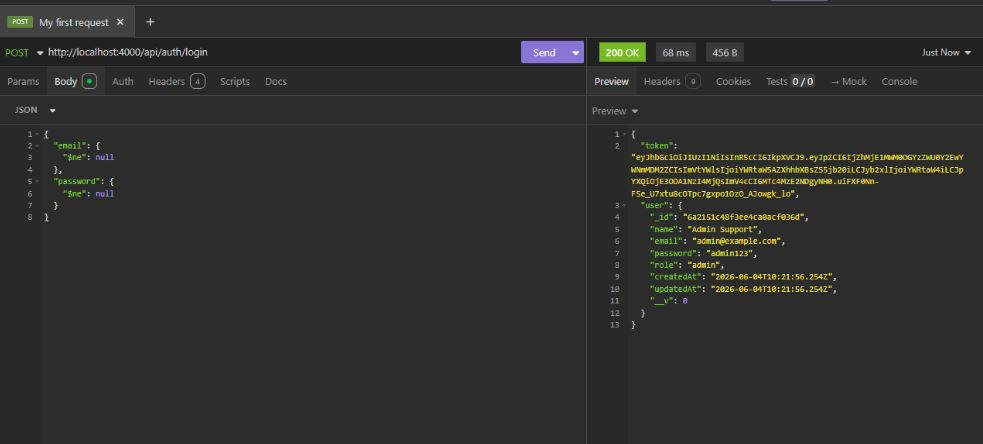

La capture montre une requete `POST /api/auth/login` avec le payload NoSQL et une reponse `200 OK` contenant un token JWT et un utilisateur.

### Impact

Un attaquant peut se connecter sans connaitre de vrais identifiants.

Impact possible :

- compromission de compte ;
- acces aux tickets d'autres utilisateurs ;
- acces a des fonctionnalites admin si le compte retourne est admin ;
- fuite de donnees.

### Criticite

Critique.

### Correction appliquee dans `secure`

La correction verifie que `email` et `password` sont bien des chaines, refuse les objets JSON et recherche uniquement l'utilisateur par email normalise.

Extrait corrige dans `backend/src/routes/auth.js` :

```js
if (typeof email !== 'string' || typeof password !== 'string') {
  return 'Invalid credentials';
}

const user = await User.findOne({ email: normalizeEmail(req.body.email) }).select('+password');
```

Les mots de passe sont compares avec bcrypt :

```js
if (!user || !(await user.comparePassword(req.body.password))) {
  return res.status(401).json({ message: 'Invalid email or password' });
}
```

### Validation apres correction

Capture :

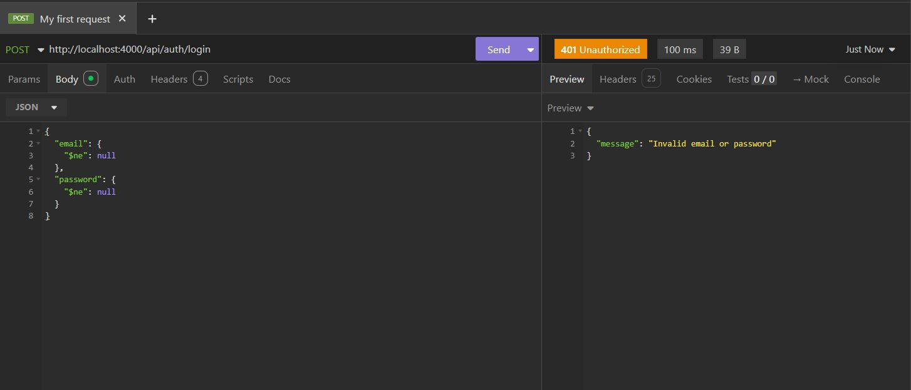

Le meme payload retourne maintenant :

```text
401 Unauthorized
Invalid email or password
```

Aucun token n'est retourne.

## VULN-02 - IDOR/BOLA sur consultation de ticket

### Type

Broken Access Control / IDOR / BOLA.

### Endpoint concerne

```text
GET /api/tickets/:id
PATCH /api/tickets/:id
```

### Description

Dans la branche `vulnerable`, un utilisateur authentifie peut consulter un ticket uniquement a partir de son identifiant, meme si ce ticket appartient a un autre utilisateur.

### Cause technique

Dans `backend/src/routes/tickets.js`, la version vulnerable recupere le ticket par son ID sans verifier le proprietaire :

```js
const ticket = await Ticket.findById(req.params.id);
```

Aucun controle ne verifie que :

```text
ticket.owner == req.user._id
```

### Exploitation

L'utilisateur `user1@example.com` recupere l'ID d'un ticket appartenant a `user2@example.com`, puis accede directement a :

```text
/tickets/ID_DU_TICKET_USER2
```

### Preuve vulnerable

Capture :

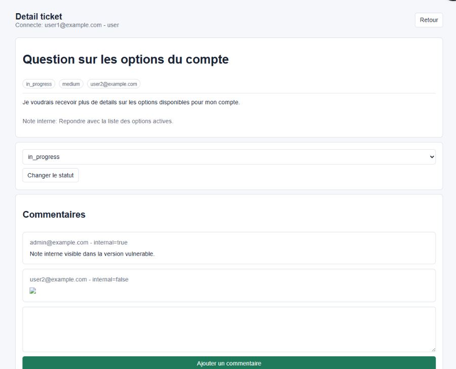

La capture montre :

- utilisateur connecte : `user1@example.com` ;
- ticket affiche : `Question sur les options du compte` ;
- proprietaire du ticket : `user2@example.com`.

### Impact

Un utilisateur peut consulter des tickets qui ne lui appartiennent pas.

Impact possible :

- fuite de donnees personnelles ;
- exposition de demandes support ;
- exposition de notes internes ;
- violation de confidentialite.

### Criticite

Elevee.

### Correction appliquee dans `secure`

Un controle ownership est ajoute cote backend.

Extrait corrige dans `backend/src/routes/tickets.js` :

```js
function isOwner(ticket, user) {
  return ticket.owner?._id?.toString() === user._id.toString()
    || ticket.owner?.toString() === user._id.toString();
}

function canRead(ticket, user) {
  return isAdmin(user) || isOwner(ticket, user);
}
```

L'acces est refuse si l'utilisateur n'est ni proprietaire ni admin :

```js
if (!ticket || !canRead(ticket, req.user)) {
  return res.status(404).json({ message: 'Ticket not found' });
}
```

### Validation apres correction

Capture :

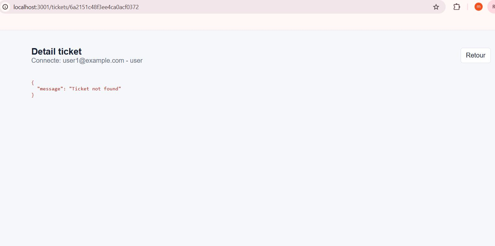

La capture montre que `user1@example.com` obtient :

```text
Ticket not found
```

lorsqu'il tente d'acceder au ticket de `user2@example.com`.

## VULN-03 - XSS stockee dans les commentaires

### Type

Stored Cross-Site Scripting.

### Zones concernees

```text
Commentaires de tickets
Descriptions de tickets
```

### Description

Dans la branche `vulnerable`, l'application affiche du contenu utilisateur comme du HTML. Un utilisateur peut donc injecter du HTML ou du JavaScript dans un commentaire.

### Cause technique

Dans `frontend/app/tickets/[id]/page.js`, la version vulnerable utilise un rendu HTML non securise sur du contenu utilisateur :

```js
<div dangerouslySetInnerHTML={{ __html: item.body }} />
```

Le backend ne nettoie pas les donnees avant stockage.

### Exploitation

Payload utilise dans un commentaire :

```html
<h2 style="color:red">XSS STOCKEE</h2>
```

Le contenu est stocke en base puis interprete par le navigateur lors de l'affichage du ticket.

### Preuve vulnerable

Capture :

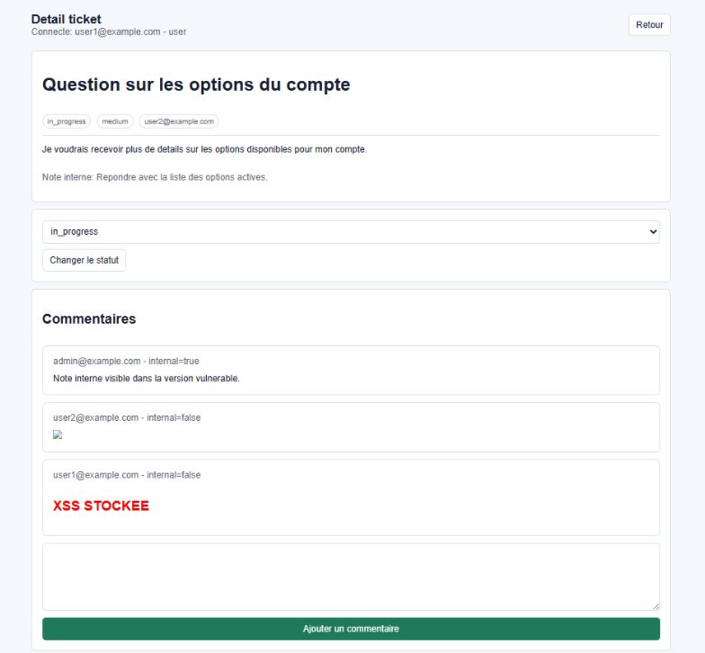

La capture montre le texte `XSS STOCKEE` affiche en rouge, preuve que le HTML injecte est interprete.

### Impact

Un attaquant peut injecter du contenu malveillant dans les tickets.

Impact possible :

- vol de token JWT stocke dans `localStorage` ;
- actions effectuees au nom d'un utilisateur ;
- modification du contenu affiche ;
- attaque contre un administrateur ouvrant le ticket.

### Criticite

Elevee.

### Correction appliquee dans `secure`

Le rendu HTML dangereux est supprime. Le contenu utilisateur est affiche comme texte.

Extrait corrige dans `frontend/app/tickets/[id]/page.js` :

```jsx
<p>{item.body}</p>
```

La description du ticket est egalement affichee comme texte :

```jsx
<p className="ticket-body">{data.ticket.description}</p>
```

### Validation apres correction

Capture :

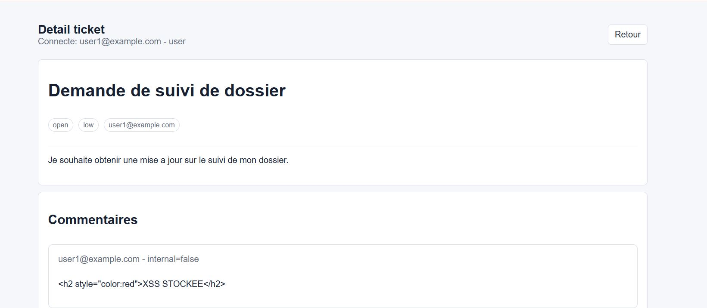

Le payload :

```html
<h2 style="color:red">XSS STOCKEE</h2>
```

est affiche tel quel, sans interpretation HTML.

## VULN-04 - Authentification faible

### Type

Authentication Weakness.

### Zones concernees

```text
POST /api/auth/login
Local Storage
Page admin
```

### Description

Dans la branche `vulnerable`, plusieurs faiblesses sont presentes :

- mots de passe stockes en clair ;
- messages d'erreur trop detailles ;
- token JWT stocke dans `localStorage` ;
- absence de rate limiting ;
- secret JWT faible ;
- duree de vie du token trop longue.

### Cause technique

Les mots de passe sont stockes directement dans MongoDB.

Le login retourne des messages contenant les valeurs testees :

```text
Login failed for email=... and password=...
```

Le frontend stocke le token JWT dans :

```text
localStorage
```

### Exploitation

Un mauvais login affiche une erreur contenant l'email et le mot de passe soumis.

Le token JWT est visible dans DevTools :

```text
Application -> Local Storage -> http://localhost:3001
```

### Preuves vulnerable

Captures :

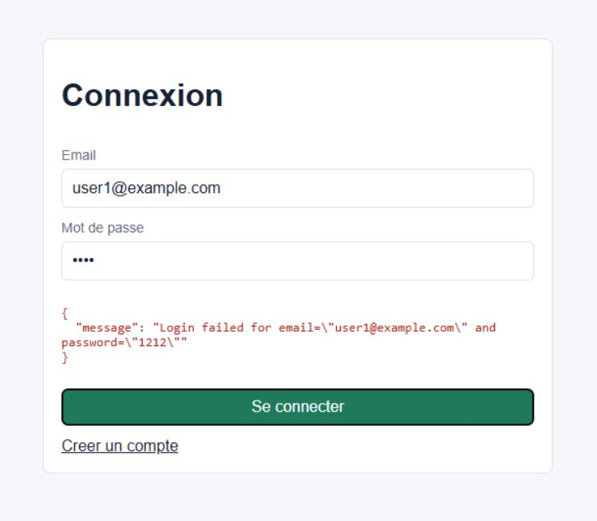

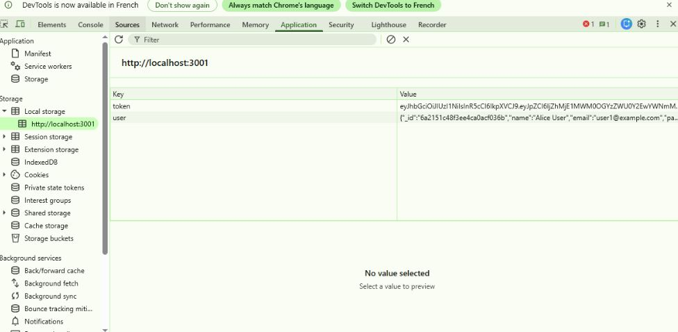

### Impact

Impact possible :

- fuite d'informations pendant les tentatives de connexion ;
- vol de token via XSS ;
- reutilisation du token ;
- brute force facilite par absence de limitation.

### Criticite

Elevee.

### Correction appliquee dans `secure`

Les mots de passe sont hashes avec bcrypt dans `backend/src/models/User.js` :

```js
userSchema.pre('save', async function hashPassword(next) {
  if (!this.isModified('password')) return next();
  this.password = await bcrypt.hash(this.password, 12);
  next();
});
```

Le login utilise un message generique :

```js
return res.status(401).json({ message: 'Invalid email or password' });
```

Le token JWT est envoye dans un cookie HTTP-only :

```js
res.cookie('token', token, {
  httpOnly: true,
  sameSite: 'lax',
  secure: process.env.NODE_ENV === 'production',
  maxAge: 2 * 60 * 60 * 1000
});
```

Un rate limiting est ajoute sur le login :

```js
const loginLimiter = rateLimit({
  windowMs: 15 * 60 * 1000,
  limit: 5
});
```

### Validation apres correction

Captures :

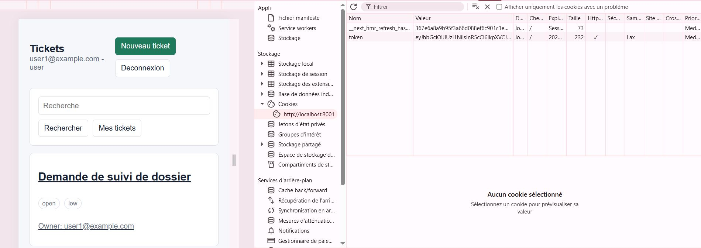


Le capture montre que `localStorage` ne contient plus de token et que le token est stocke dans un cookie `HttpOnly`.


## VULN-05 - Mass Assignment / elevation de privilege

### Type

Mass Assignment / Privilege Escalation.

### Endpoints concernes

```text
POST /api/auth/register
POST /api/tickets
PATCH /api/tickets/:id
PATCH /api/users/me
```

### Description

Dans la branche `vulnerable`, l'application accepte directement les champs envoyes par le client. Un utilisateur peut donc fournir ou modifier des champs sensibles.

Exemples :

- choisir `role: admin` pendant l'inscription ;
- modifier le statut d'un ticket ;
- renseigner une note interne ;
- potentiellement modifier le proprietaire d'un ticket.

### Cause technique

Le backend utilise directement `req.body` :

```js
User.create(req.body)
Ticket.findByIdAndUpdate(req.params.id, req.body)
```

Il n'y a pas de liste blanche des champs autorises.

### Exploitation

Pendant l'inscription, l'utilisateur peut selectionner le role :

```text
admin
```

Un utilisateur simple peut aussi changer le statut d'un ticket appartenant a un autre utilisateur.

### Preuves vulnerable

Captures :

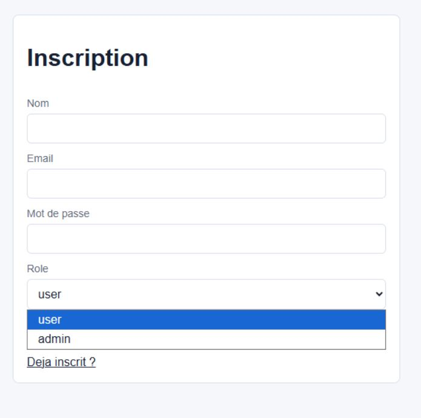

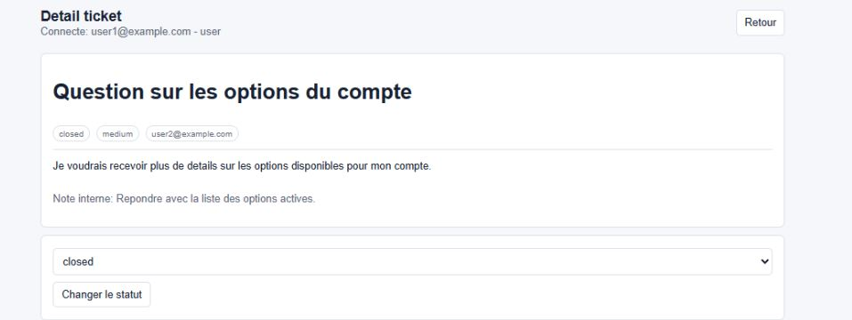

La capture du changement de statut montre :

- utilisateur connecte : `user1@example.com` ;
- proprietaire du ticket : `user2@example.com` ;
- statut modifie : `closed`.

### Impact

Impact possible :

- creation illegitime de comptes admin ;
- modification non autorisee de tickets ;
- fermeture de demandes support d'autres utilisateurs ;
- alteration de donnees metier.

### Criticite

Critique.

### Correction appliquee dans `secure`

L'inscription ignore le role fourni par le client :

```js
const user = await User.create({
  name: req.body.name.trim(),
  email: normalizeEmail(req.body.email),
  password: req.body.password,
  role: 'user'
});
```

Le formulaire frontend ne propose plus le champ `Role`.

Les tickets n'acceptent plus tous les champs du client. Seuls les champs autorises sont traites.

Pour la creation de ticket :

```js
const ticket = await Ticket.create({
  title: title.trim(),
  description: description.trim(),
  priority: priority || 'medium',
  status: 'open',
  owner: req.user._id
});
```

Pour le changement de statut :

```js
if (isAdmin(req.user)) {
  const { status, assignedTo, internalNote } = req.body;
}
```

### Validation apres correction

Captures :


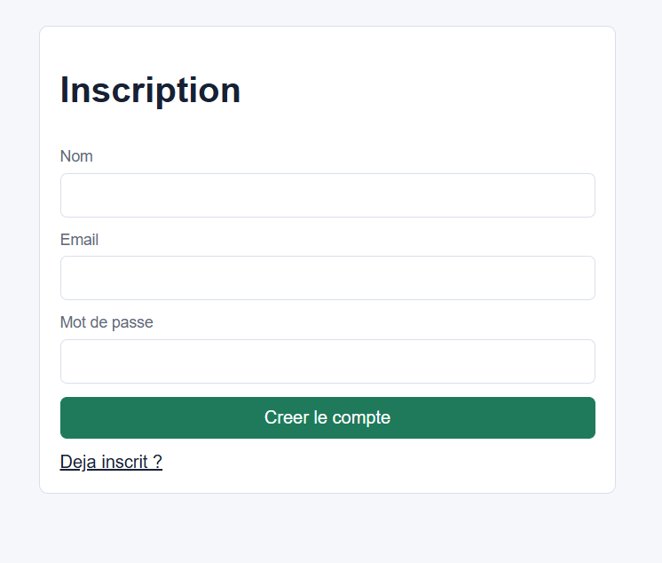

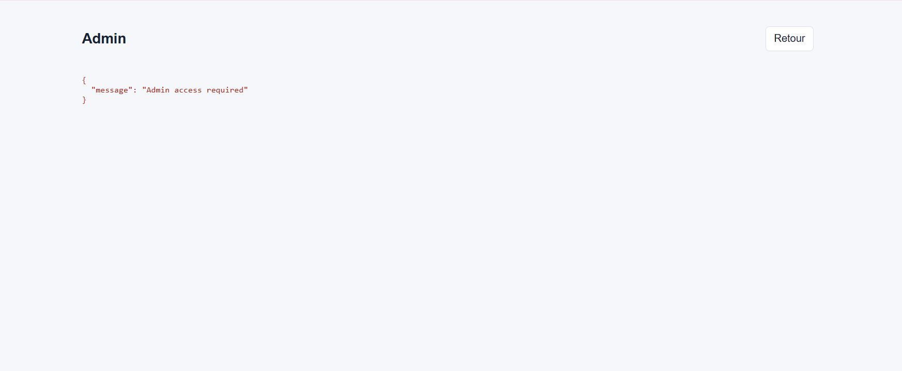

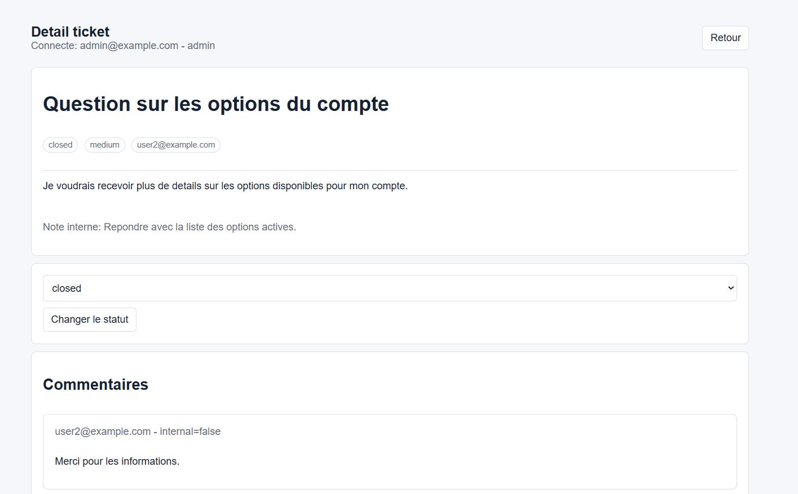

Les captures montrent :

- suppression du champ `Role` a l'inscription ;
- acces admin refuse pour un utilisateur simple ;
- changement de statut disponible uniquement pour l'admin.

## VULN-06 - Information Disclosure / Security Misconfiguration

### Type

Information Disclosure / Security Misconfiguration.

### Zones concernees

```text
/admin
Erreurs API
Reponses backend
```

### Description

Dans la branche `vulnerable`, l'application expose trop d'informations sensibles.

La page admin affiche :

- emails ;
- roles ;
- mots de passe ;
- tickets des utilisateurs ;
- commentaires internes.

Les erreurs API affichent aussi :

- stack trace ;
- headers HTTP ;
- token JWT ;
- body de la requete.

### Cause technique

Le backend retourne les objets complets depuis MongoDB sans filtrer les champs sensibles.

Le gestionnaire d'erreurs retourne des informations de debug :

```js
res.status(500).json({
  message: error.message,
  stack: error.stack,
  request: {
    headers: req.headers
  }
});
```

### Exploitation

Un utilisateur connecte peut acceder a la page admin et voir les informations sensibles.

Une erreur de validation sur les commentaires affiche une stack trace complete et le token JWT.

### Preuves vulnerable

Captures :

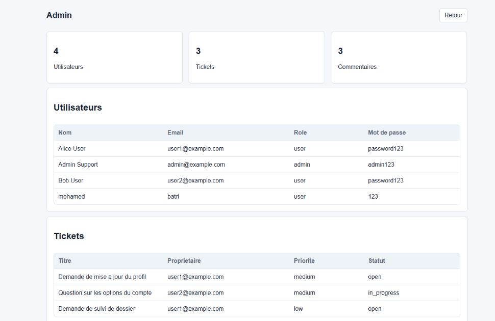

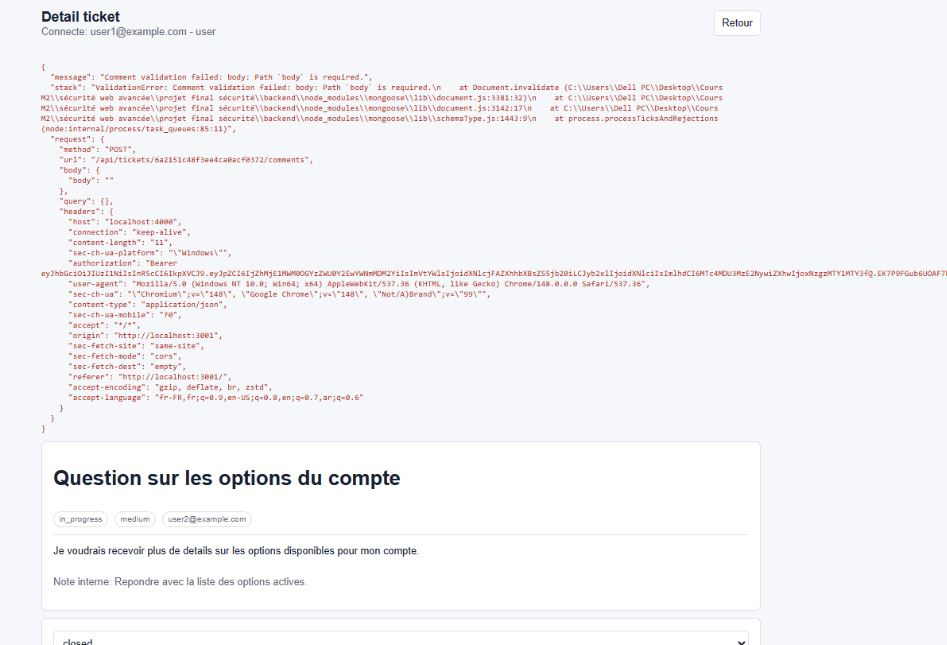

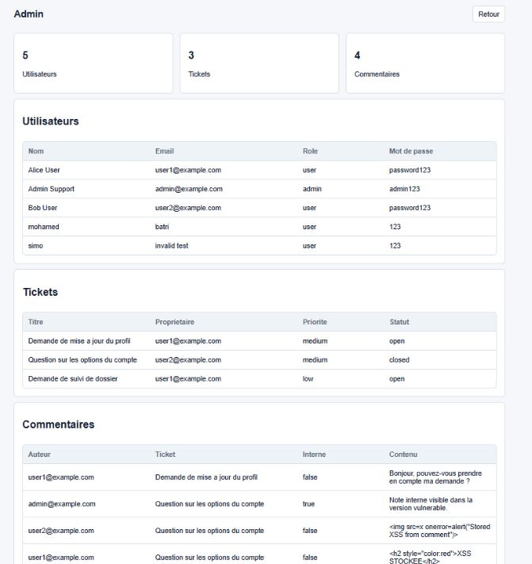

### Impact

Impact possible :

- fuite de mots de passe ;
- exposition de tokens ;
- aide a l'exploitation d'autres failles ;
- fuite de donnees metier et personnelles.

### Criticite

Elevee.

### Correction appliquee dans `secure`

Les mots de passe ne sont plus selectionnes par defaut dans le modele `User` :

```js
password: { type: String, required: true, select: false }
```

Le modele supprime aussi le champ `password` lors de la serialisation :

```js
delete ret.password;
```

La route admin est protegee par `requireAdmin` :

```js
router.get('/stats', requireAuth, requireAdmin, async (req, res, next) => {
```

Le gestionnaire d'erreurs retourne des messages generiques :

```js
res.status(500).json({ message: 'Internal server error' });
```

Helmet et CORS restreint sont ajoutes :

```js
app.use(helmet());
app.use(cors({ origin: frontendOrigin, credentials: true }));
```

### Validation apres correction

Captures :


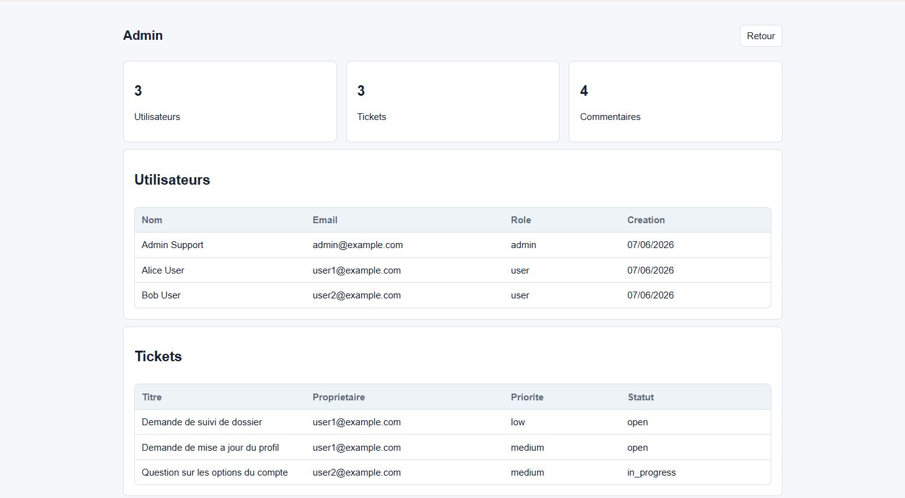

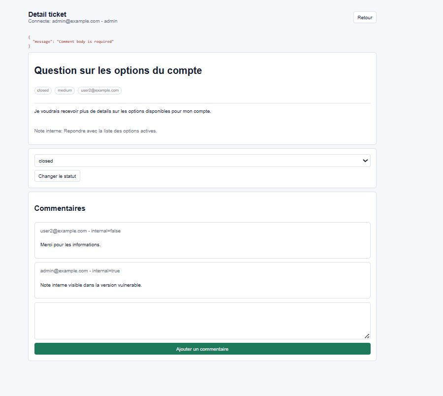

Les captures montrent :

- acces admin bloque pour un utilisateur simple ;
- page admin sans colonne `Mot de passe` ;
- erreur simple sans stack trace, sans headers et sans token.

## VULN-07 - Validation insuffisante des entrees

### Type

Input Validation.

### Zone concernee

```text
POST /api/auth/register
```

### Description

Dans la branche `vulnerable`, l'application accepte un email invalide pendant l'inscription.

Un utilisateur peut creer un compte avec une valeur comme :

```text
invalid test
```

au lieu d'une adresse email valide.

### Cause technique

Le backend ne valide pas strictement le format de l'email.

Le schema MongoDB impose seulement que le champ existe, mais pas qu'il respecte un format email.

### Exploitation

Creation d'un compte avec :

```text
Email: invalid test
Mot de passe: 123
Role: user
```

### Preuve vulnerable

Capture :

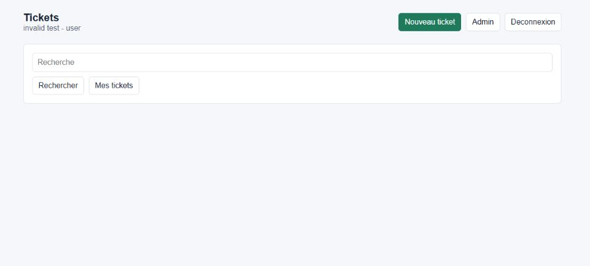

La capture montre l'utilisateur connecte avec un email invalide.

### Impact

Impact possible :

- donnees incoherentes en base ;
- comptes non joignables ;
- contournement de regles metier ;
- difficulte de tracabilite.

### Criticite

Moyenne.

### Correction appliquee dans `secure`

La route register valide le format de l'email et la longueur du mot de passe :

```js
if (typeof email !== 'string' || !/^[^\s@]+@[^\s@]+\.[^\s@]+$/.test(email.trim())) {
  return 'Email format is invalid';
}

if (typeof password !== 'string' || password.length < 8) {
  return 'Password must contain at least 8 characters';
}
```

Le schema Mongoose ajoute aussi une validation email :

```js
match: [/^[^\s@]+@[^\s@]+\.[^\s@]+$/, 'Invalid email format']
```

### Validation apres correction

Capture :

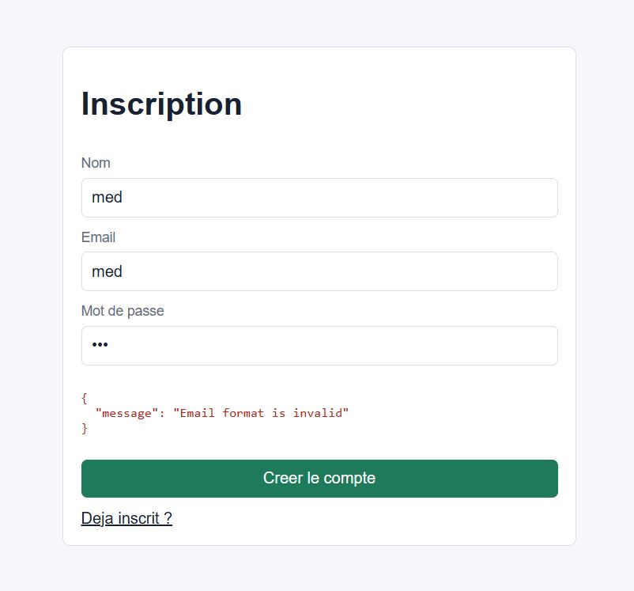

La creation d'un compte avec `med` comme email retourne :

```text
Email format is invalid
```

## 7. Pipeline securite

La branche `secure` contient une pipeline GitHub Actions :

```text
.github/workflows/security.yml
```

Elle s'execute automatiquement sur :

```text
push vers secure
pull_request vers secure
```

### Controles automatises

La pipeline contient :

- installation des dependances backend et frontend ;
- tests backend ;
- tests frontend ;
- build frontend ;
- audit des dependances backend ;
- audit des dependances frontend ;
- SAST avec Semgrep ;
- secret scanning avec Gitleaks ;
- DAST avec OWASP ZAP baseline.

### Extrait de pipeline

```yaml
- name: Backend tests
  working-directory: backend
  run: npm test

- name: Frontend tests
  working-directory: frontend
  run: npm test

- name: Semgrep SAST
  uses: semgrep/semgrep-action@v1
  with:
    config: p/owasp-top-ten

- name: Gitleaks secret scanning
  uses: gitleaks/gitleaks-action@v2
```

### Preuve

Captures :

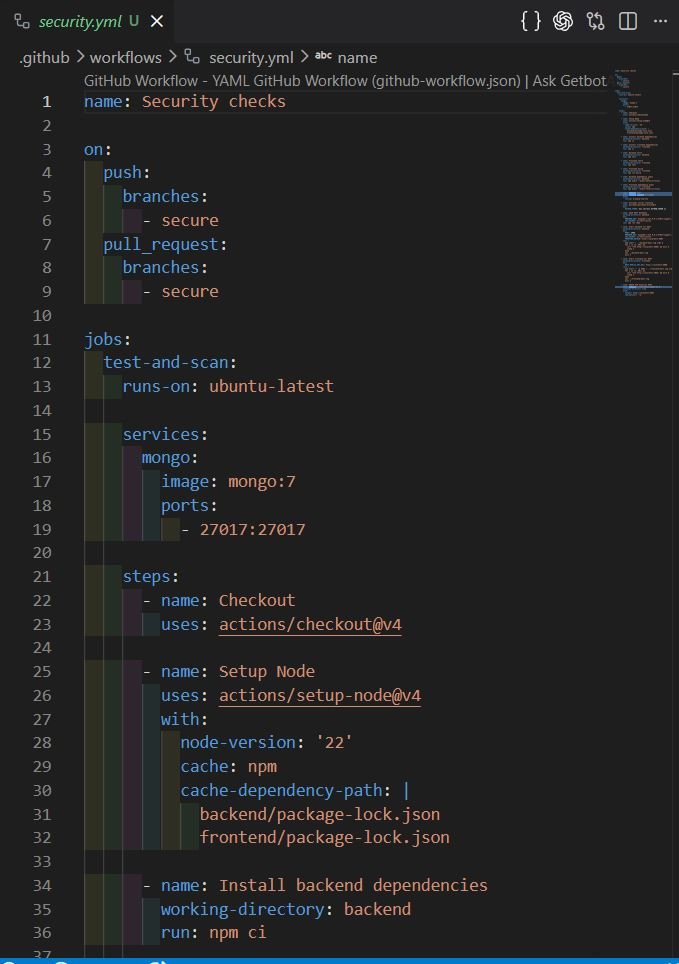

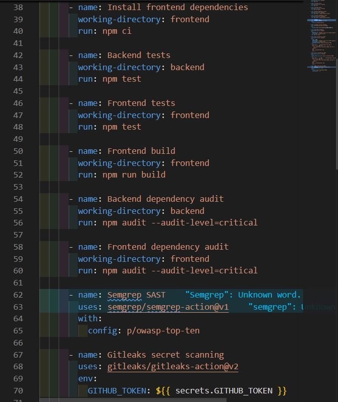

La capture montre les etapes tests, build, audit, Semgrep et Gitleaks.

## 8. Resultats des scans et tests

### Tests de securite backend

Fichier :

```text
backend/test/security-hardening.test.js
```

Les tests verifient que :

- la recherche de tickets n'utilise plus `$where` ;
- le login rejette les identifiants sous forme d'objet JSON ;
- l'inscription ne fait plus confiance au role fourni par le client ;
- les erreurs API ne retournent plus stack traces ni headers.

Resultat :

```text
pass 4
fail 0
```

### Tests de securite frontend

Fichier :

```text
frontend/test/security-hardening.test.js
```

Les tests verifient que :

- le frontend n'utilise plus `dangerouslySetInnerHTML` ;
- le formulaire d'inscription n'expose plus le choix du role ;
- le frontend ne stocke plus le JWT dans `localStorage`.

Resultat :

```text
pass 3
fail 0
```

### Preuve des tests

Captures :

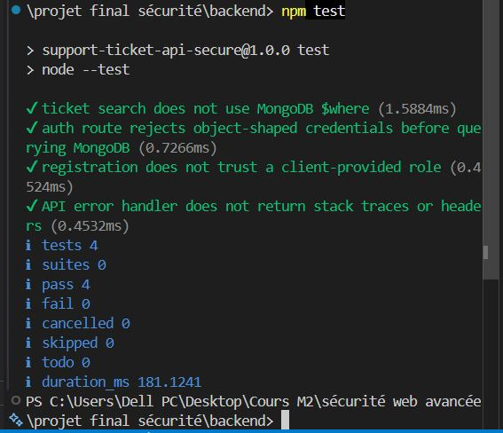

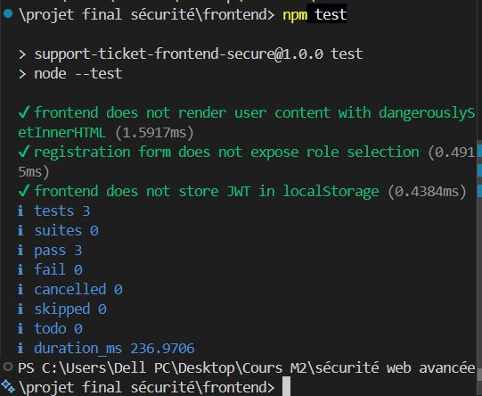

### Audit des dependances

Backend :

```text
npm audit --audit-level=critical
found 0 vulnerabilities
```

Frontend :

```text
npm audit --audit-level=critical
2 moderate severity vulnerabilities
```

Les vulnerabilites frontend detectees sont de severite `moderate` et concernent `postcss` via `next`. La pipeline bloque les vulnerabilites critiques avec `--audit-level=critical`, ce qui respecte l'objectif de bloquer les risques critiques.

### Preuve audit

Captures :

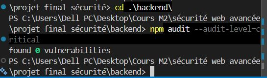

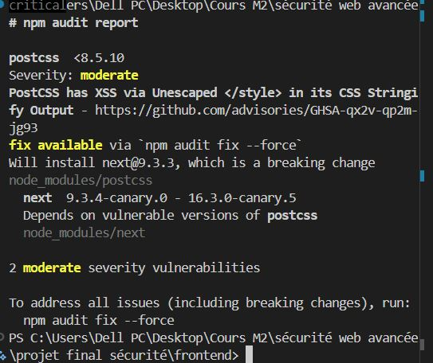

## 9. Limites du projet

Cette application reste un projet pedagogique.

Limites connues :

- le systeme de roles est limite a `user` et `admin` ;
- il n'y a pas de workflow complet de support avec assignation avancee ;
- le DAST OWASP ZAP est configure en baseline et non comme audit complet authentifie ;
- les tests automatises ciblent principalement les failles documentees ;
- la gestion des cookies devrait etre renforcee en production avec HTTPS obligatoire et configuration stricte de domaine.

## 10. Conclusion

La branche `vulnerable` contient les failles obligatoires demandees dans le projet :

- Broken Access Control / IDOR / BOLA ;
- Injection ;
- XSS ;
- authentification faible ;
- Mass Assignment ;
- Security Misconfiguration / Information Disclosure.

La branche `secure` corrige les causes profondes de ces failles :

- validation stricte des entrees ;
- mots de passe hashes ;
- cookie JWT HTTP-only ;
- controle ownership cote backend ;
- controle de role admin ;
- suppression du rendu HTML dangereux ;
- filtrage des champs sensibles ;
- erreurs generiques ;
- headers de securite ;
- pipeline DevSecOps.

Les captures vulnerable prouvent l'exploitation des failles. Les captures secure prouvent que les memes attaques sont maintenant bloquees ou neutralisees.

Le projet montre donc le cycle complet attendu : developpement vulnerable, audit personnel, exploitation controlee, correction, validation et automatisation des controles de securite.
